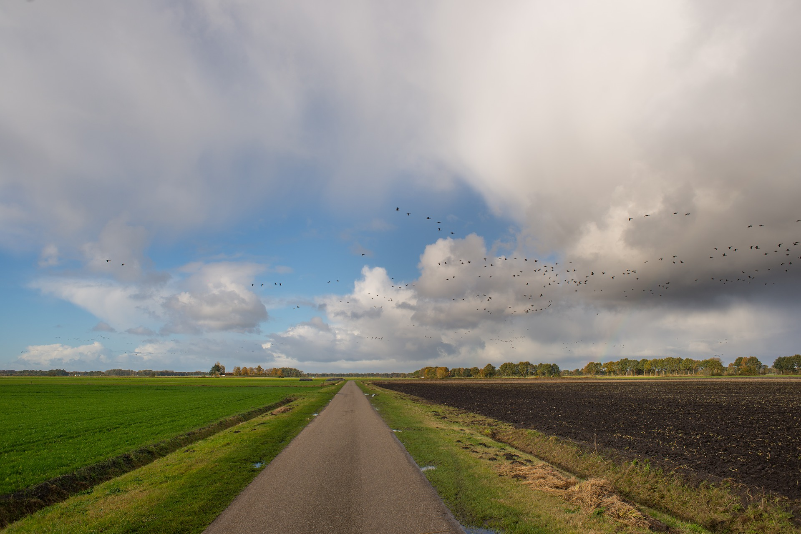
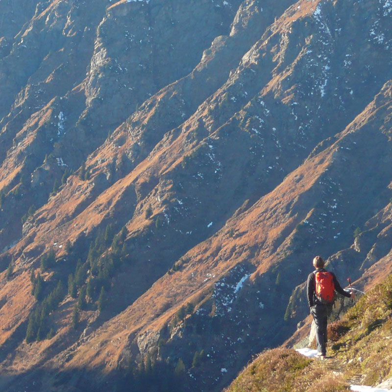
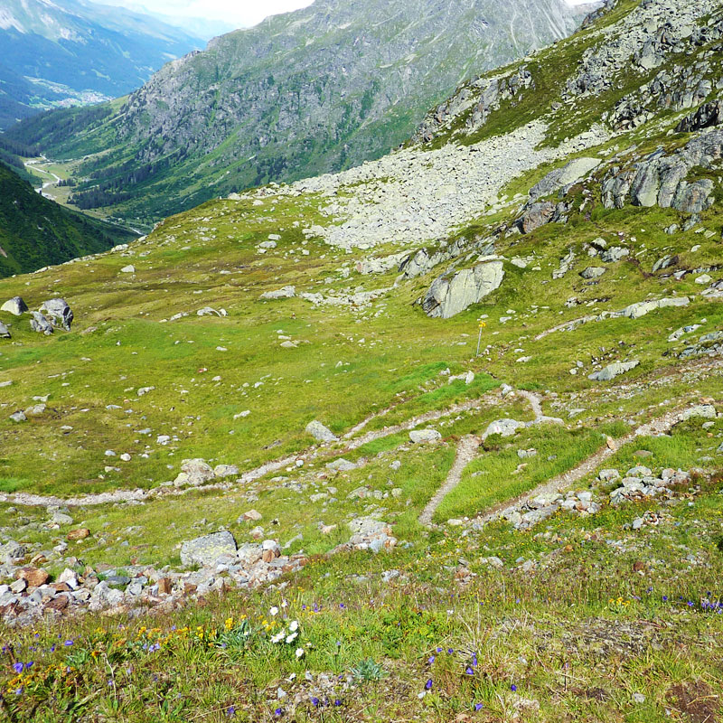
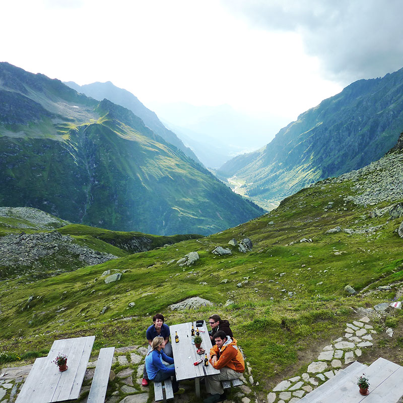
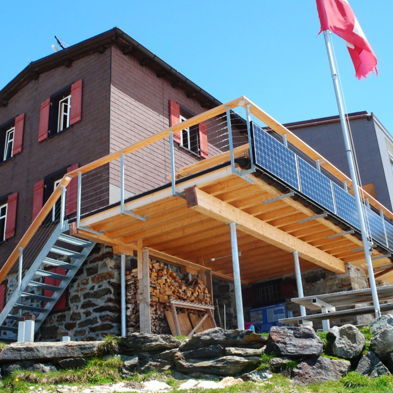

<!-- .slide: data-background="img/bg-main.png" -->

## 3D with [#esrijs](https://developers.arcgis.com/javascript/)
###  EU DevSummit 2017 - Speedgeeking

 

<small>
Javier Gutierrez | [javier_gutierrez@esri.com](mailto:javier_gutierrez@esri.com) | [@jgutierrez0](https://twitter.com/jgutierrez0)
 
ESRI R&amp;D Center Zürich
</small>

 

   <small><small>
    <a target="_blank" href="https://github.com/gutierrezj/eudevsummit2017/tree/master/speedgeeking">see source code for this presentation</a>
   </small></small>
 

---

## let's go hiking?

---

---

## not bad, but a bit 2D-ish..

---

## how about some mountains?

---

 
<small>
<small>
Photos courtesy of [SAC Silvretta Hütte](https://www.silvrettahuette.ch)
</small>
</small>

---

### SAC Silvretta Hütte https://www.silvrettahuette.ch

<small>
<small>
Photos courtesy of [SAC Silvretta Hütte](https://www.silvrettahuette.ch)
</small>
</small>

---

### Hike to Silvretta hut, in the Swiss Alps

  

    <pre>
      <code class="lang-js hljs javascript">
var map = new WebMap({
  portalItem:{
    id: "d721eb35a09747e4a1aa8bcd491d9ecc"
  }
});

var view = new MapView({
  map: map,
  container: "viewDiv"
});
      </code>
   </pre>
  

  

    <iframe id="frame-auto-cast" data-src="./snippets/hike-map.html"></iframe>
  

 

   <small><small>
    <a href="./snippets/hike-map.html">full screen</a>
   </small></small>
 

---

### Hike to Silvretta hut, in the Swiss Alps, with a Legend!

  

    <pre>
      <code class="lang-js hljs javascript">
var map = new WebMap({
  portalItem:{
    id: "d721eb35a09747e4a1aa8bcd491d9ecc"
  }
});

var view = new MapView({
  map: map,
  container: "viewDiv"
});

var legend = new Legend({ view: view });
view.ui.add(legend);
      </code>
   </pre>
  

  

    <iframe id="frame-auto-cast" data-src="./snippets/hike-map-legend.html"></iframe>
  

 

   <small><small>
    <a href="./snippets/hike-map-legend.html">full screen</a>
   </small></small>
 

---

### Hike to Silvretta hut, in the Swiss Alps, with a Legend, in 3D! :)

  

    <pre>
      <code class="lang-js hljs javascript">
var map = new WebScene({
  portalItem:{
    id: "5682cd69fe5c451d8924d38d6cc918d4"
  }
});

var view = new SceneView({
  map: map,
  container: "viewDiv"
});

var legend = new Legend({ view: view });
view.ui.add(legend);
      </code>
   </pre>
  

  

    <iframe id="frame-auto-cast" data-src="./snippets/hike-scene.html"></iframe>
  

 

   <small><small>
    <a href="./snippets/hike-scene.html">full screen</a>
   </small></small>
 

---

### Hike to Silvretta hut, in the Swiss Alps, with a Legend, in 3D,   with Elevation! \o/

  

    <pre>
      <code class="lang-js hljs javascript">var map = new WebScene({
  portalItem:{
    id: "5682cd69fe5c451d8924d38d6cc918d4"
  }
});

var view = new SceneView({
  map: map,
  container: "viewDiv"
});

var legend = new Legend({ view: view });
view.ui.add(legend);

view.then(() => {
  map.ground = "world-elevation";
});
      </code>
   </pre>
  

  

    <iframe id="frame-auto-cast" data-src="./snippets/hike-scene-elevation.html"></iframe>
  

 

   <small><small>
    <a href="./snippets/hike-scene-elevation.html">full screen</a>
   </small></small>
 

---

### More 3D: Set Camera

  

    <pre>
      <code class="lang-js hljs javascript">
view.then(() => {
  map.ground = "world-elevation";

  // use goTo for moving camera
  view.goTo({

    // console: JSON.stringify(view.camera.toJSON())
    tilt: 60,
    heading: 78,
    position: {
      x: 1108833,
      y: 5917218,
      z: 5432,
      spatialReference: { wkid: 3857 }
    }
  });
});
      </code>
   </pre>
  

  

    <iframe id="frame-auto-cast" data-src="./snippets/hike-scene-camera.html"></iframe>
  

 

   <small><small>
    <a href="./snippets/hike-scene-camera.html">full screen</a>
   </small></small>
 

---

### More 3D: Points elevation info

  

    <pre>
      <code class="lang-js hljs javascript">
view.then(() => {

  var lyr = map.layers.find(l=> l.title == "POI");

  lyr.elevationInfo = {
    mode: "relative-to-scene"
  };

});
      </code>
   </pre>
  

  

    <iframe id="frame-auto-cast" data-src="./snippets/hike-scene-elevationInfo.html"></iframe>
  

 

   <small><small>
    <a href="./snippets/hike-scene-elevationInfo.html">full screen</a>
   </small></small>
 

---

### More 3D: Callouts for Points

  

    <pre>
      <code class="lang-js hljs javascript">symbol: {
  type: "point-3d",
  symbolLayers: [{
    type: "icon",
    size: 11.25,
    resource: { primitive: "circle" },
    material: { color: [237, 81, 81] }
  }],
  verticalOffset: {
    screenLength: 30,
    maxWorldLength: 300
  },
  callout: {
    type: "line",
    size: 0.6,
    color: [25, 25, 25]
  }
}</code>
   </pre>
  

  

    <iframe id="frame-auto-cast" data-src="./snippets/hike-scene-callouts.html"></iframe>
  

 

   <small><small>
    <a href="./snippets/hike-scene-callouts.html">full screen</a>
   </small></small>
 

---

### Want to know more about 3D with EsriJS ?

| Wednesday  | Thursday  |
| ---------- | --------- |
| Practical Guide to Building 3D Web Apps  <small>9:00 AM @ Room A03 - A04</small> | Indexed 3D Scene (I3S) Layers Specification  <small>10:00 AM @ Room B09</small>|
| Working in 3D with the ArcGIS API for JavaScript  <small>3:00 PM @ Room B05</small> | Practical Guide to Building 3D Web Apps  <small>11:00 AM @ Room B09 </small>|

---

<!-- .slide: data-background="img/bg-main.png" -->

##  Thanks for listening!

### 3D with [#esrijs](https://developers.arcgis.com/javascript/)
 
<small>
Javier Gutierrez | [javier_gutierrez@esri.com](mailto:javier_gutierrez@esri.com) | [@jgutierrez0](https://twitter.com/jgutierrez0)
 
ESRI R&amp;D Center Zürich
</small>

 

   <small><small>
    <a target="_blank" href="https://github.com/gutierrezj/eudevsummit2017/tree/master/speedgeeking">see source code for this presentation</a>
   </small></small>
 

