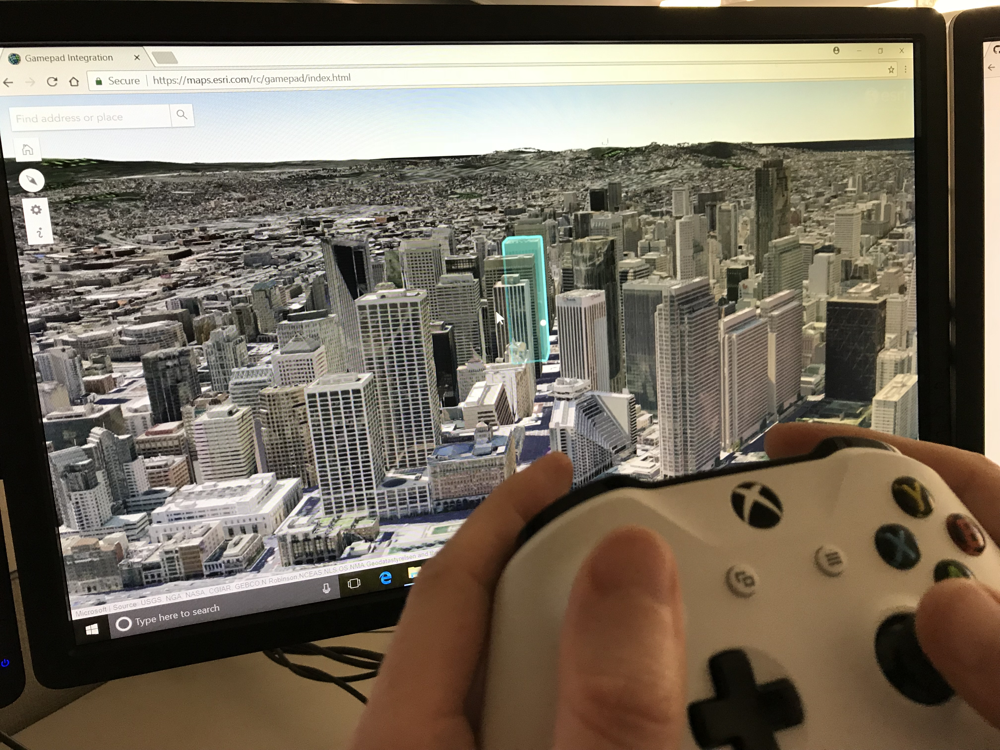

# Gamepad Sample

This is an experimental project to test the effectiveness of using a Microsoft [Xbox controller](https://en.wikipedia.org/wiki/Xbox_360_controller) to navigate in a 3d web application built using [Esri](https://www.esri.com)'s [ArcGIS API for JavaScript](https://developers.arcgis.com/javascript/).

Click [here](https://richiecarmichael.github.io/gamepad/index.html) for the live application.

To date the app has only been tested on Windows desktops with Xbox game controllers such as [this](https://www.microsoft.com/accessories/en-us/products/gaming/xbox-360-controller-for-windows/52a-00004), [this](https://www.microsoft.com/accessories/en-us/products/gaming/xbox-360-wireless-controller-for-windows/jr9-00011), [this](https://www.microsoft.com/accessories/en-us/products/gaming/xbox-controller-cable-for-windows) and [this](https://www.microsoft.com/accessories/en-us/products/gaming/xbox-controller-wireless-adapter-for-windows-10).

The application was built using the following technologies:
- [ArcGIS API for JavaScript](https://developers.arcgis.com/javascript/) by [Esri](https://www.esri.com)
- [Bootstrap](https://getbootstrap.com/) by [Twitter Inc](https://twitter.com/)
- [jQuery](https://jquery.com/) by the jQuery Foundation Inc.
- [Open Iconic](https://github.com/cowboy/jquery-throttle-debounce/) by [Iconic](https://github.com/cowboy)
- [Popper.js](https://github.com/jquery/jquery-mousewheel/) by [Federico Zivolo](https://github.com/FezVrasta).

By default, [this](https://www.arcgis.com/home/item.html?id=53d44be1fd7443a99cf0fbf7d95a2365) web scene of San Francisco is used. To use an alternative scene, use a *webscene* query to specify the id of the alternative scene. For example:
https://richiecarmichael.github.io/gamepad/index.html?webscene=5c2293d8f06448f9a05fa508b4f28b9e

## Known Issues

* When the app starts, the camera may spontaneously creep without any controller interaction. Occasionally it may be an erratic spin. To correct this, after a few seconds press the **start** button. This will reset the controller.
* Occasionally when the app starts, scene layers (e.g. buildings) may no fully load. To correct this refresh the browser and wait 5-10 seconds before using the controller.

## The Caveats

* The app is experimental. The app is based on draft implementations of the [gamepad API](https://w3c.github.io/gamepad/) in modern browsers.
* The app has not been tested with a Sony PlayStation controller.

## Demonstration

